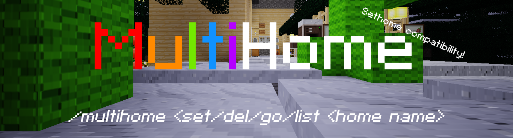

MultiHome [multihome]
=====================
- GitHub: https://github.com/octacian/multihome
- Download: https://github.com/octacian/multihome/archive/master.zip
- Forum: https://forum.minetest.net/viewtopic.php?f=9&t=17587

MultiHome is a Minetest mod allowing players to set multiple homes rather than just one home through Minetest Game's sethome mod. MultiHome supports limiting the max number of homes per-player (default: 5) and has two compatibility layers to allow working with sethome. The chatcommands made available by MultiHome depend on the compatibility mode chosen, as shown below.

__Note:__ If MultiHome is set to no compatibility mode, the `multihome` privilege is required to use MultiHome features, otherwise the `home` privilege from sethome is used.

## Compatibility
MultiHome provides exactly two compatibility modes allowing the mod to work with homes previously created with the sethome mod. If no compatibility mode is set, the setting defaults to `none` and the default set of chatcommands is used. The compatibility mode can be set with `multihome.compatiblity` in `minetest.conf`, valid values being `none`, `deprecate`, and `override`.

The first two compatibility modes use the same chatcommand (`/multihome`) as documented below, however, `deprecate` overrides chatcommands from sethome causing them to display a message stating that they are deprecated and `/multihome` should be used instead. __Note:__ If a compatibility mode is set and the sethome mod is not found, compatibility is automatically set to `none`.

When attempting to vist a home using any compatibility mode, if the player does not specify a home to teleport to and they only have one home, the player will be automatically teleported to that home.

#### Compatibility: None/Deprecate
Both the `none` and `deprecate` compatibility modes use the same chatcommand, however `deprecate` adds deprecation messages as mentioned above. The best way to learn how to use this `/multihome` chatcommand is to use the in-game help, `/help multihome`, however, an overview of the usage can be found below.

`/multihome <action> <home name> | <set, del (delete), go, list> <home name (not required with list)>`

#### Compatibility: Override
The `override` compatibility mode does not use one single chatcommand, but rather overrides the chatcommands used by sethome for use by MultiHome and registers two extras (see below).

`/home <home name>`: Teleport to the home specified 
`/sethome <home name>`: Set the position of the home specified 
`/delhome <home name>`: Delete the home specified 
`/listhomes`: List player's homes

#### Importing Homes
MultiHome supports imported homes from sethome in both the `deprecate` and `override` compatibility options. Importing can be enabled by setting `multihome.import = true` in `minetest.conf`. This will cause MultiHome to automatically import homes created by sethome in the player attributes whenever a player with a home joins. MultiHome will also import homes from the `homes` file in the world directory, however, as they are imported they cannot be removed from the file but instead set an attribute on the player indicating that any old homes have already been imported and should not be overwritten. These homes will be named `default` in MultiHome and will be removed from the player attributes after they have been imported.
